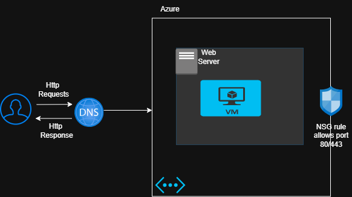
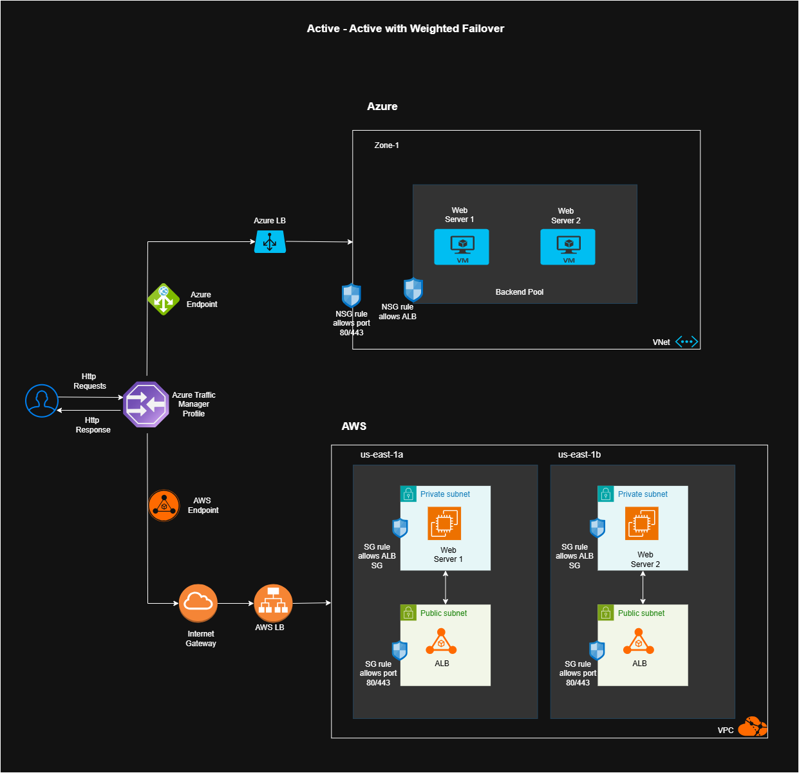

# Case Study: Deployment of Multicloud App

## Overview
This project demonstrates a **multi-cloud deployment** of a high-traffic static web application across **AWS and Azure**.  
It highlights **active-active architecture** with weighted DNS failover using **Azure Traffic Manager**, ensuring global accessibility and zero downtime.  
Key skills showcased: **cross-cloud networking, VM hosting, load balancing, DNS routing, and resiliency design**.  
Screenshots and architecture diagrams validate hands-on implementation and troubleshooting expertise.

---

## Project Scenario
A logistics company with a high-traffic B2C web application requires **global accessibility and zero downtime**.  
To achieve resiliency, the app is deployed across **AWS and Azure** with load balancing and DNS failover.  
Downtime is unacceptable due to multimillion daily traffic, so the company opted for **VM hosting** to meet legacy dependencies and compliance testing needs.

---

## Problem Understanding & Requirements
### Current Scenario
- Logistics Company  
- Static Web App  
- Huge traffic  
- Single cloud or on-prem  
- No failover  
- Basic DNS hosting  

### Proposed Requirements
- Global Accessibility  
- High Availability  
- No Downtime  
- Multi-region static web hosting  
- Network isolation  
- Routing setup  
- Traffic distribution  
- Load balancing  
- Health monitoring  
- DNS failover  

### Key Questions
- Budget for multi-region workloads in AWS + Azure?  
- Active-active or active-passive architecture?  
- DNS-based failover (Traffic Manager) or app-level routing?  
- Compliance/regulatory obligations?  

### VM vs PaaS Consideration
- **PaaS (AWS Amplify, Azure Static Web Apps):** scalable, low-maintenance, cost-effective.  
- **VM hosting:** more complexity, higher budget, but full OS-level control.  
- **Assumption:** Company opted for VMs due to legacy dependencies and compliance testing needs.  

## Existing Architecture

     
## Solution Architecture
**Active-Active with Weighted Failover**
- AWS + Azure deployments  
- DNS-based routing via Azure Traffic Manager  
- Weighted traffic distribution (e.g., 70% AWS, 30% Azure)  
- Automatic failover during outages  

**Solution Architecture Diagram**
<!---->
 
*Flagship Diagram: Active‑Active Multi‑Cloud Architecture with Weighted DNS Failover (AWS + Azure)*

## Component Mapping
### AWS Components
- Amazon EC2 → Hosts static web app  
- VPC → Isolated network environment  
- Internet Gateway → Internet access for public subnets  
- Route Tables + Subnets → Traffic flow segmentation  
- Elastic Load Balancer (ELB) → Distributes traffic across EC2 instances  
- Target Group → Registers EC2 instances for load balancing + health checks  

### Azure Components
- Resource Group → Logical container for resources  
- Virtual Network + Subnet → Isolated network environment  
- Azure VM → Hosts static web app  
- Frontend IP Config → Public IP for Load Balancer  
- Backend Pool → Contains Azure VMs  
- Health Probe → Monitors VM health  
- Azure Load Balancer (Standard) → Distributes traffic across VMs  
- Traffic Manager Profile → Geo-redundant DNS routing + failover  

## Steps to Achieve Multi-Cloud Deployment
### Phase 1: AWS Setup
1. Create VPC + Internet Gateway  
2. Configure route tables (public + private)  
3. Create subnets (public/private in 2 AZs)  
4. Define Security Groups (ALB + EC2)  
5. Launch EC2 instances (Amazon Linux 2, Apache web server)  
6. Register EC2s in Target Group with health checks  
7. Deploy Application Load Balancer across 2 AZs  
8. Test via ELB DNS name  

### Phase 2: Azure Setup
1. Create Resource Group + Virtual Network  
2. Configure inbound rules (HTTP, SSH)  
3. Launch 2 Azure VMs (Ubuntu, Apache web server)  
4. Deploy Azure Load Balancer (frontend IP, backend pool, health probe)  
5. Create Traffic Manager Profile (weighted routing)  
   - Add AWS ELB DNS endpoint  
   - Add Azure Load Balancer public IP  
   - Configure weights (e.g., 50-50 or 70-30)  
6. Test via Traffic Manager DNS name  
7. Validate weighted distribution + failover  

## Screenshots
  
  

For the full set of screenshots, [see the PDF here](./screenshots/MulticloudApp_Screenshots.pdf).

## Lessons Learned
- DNS-based failover is simpler to implement than app-level routing.  
- Weighted routing enables controlled traffic distribution across clouds.  
- VM hosting adds complexity but ensures compliance and legacy support.  
- Cross-cloud troubleshooting requires clear documentation and monitoring.  

## Tech Stack
- **Cloud Platforms:** AWS, Azure  
- **Compute:** EC2, Azure VMs  
- **Networking:** VPC, VNets, Subnets, Load Balancers  
- **Routing:** Azure Traffic Manager  
- **Web Servers:** Apache (Amazon Linux 2, Ubuntu)  

## Future Improvements
- Replace VM hosting with PaaS services for reduced maintenance.  
- Add monitoring dashboards (CloudWatch, Azure Monitor).  
- Implement CI/CD pipelines for automated deployments.  
- Explore cost optimization strategies for multi-region workloads.  

## Conclusion
This project delivers a multi-cloud architecture for a logistics company’s static web app, deployed across AWS and Azure using VMs, load balancers, and Azure Traffic Manager with weighted DNS routing.  

- Ensures high availability and global accessibility  
- Provides resiliency through health-aware endpoint monitoring  
- Demonstrates hands-on skills in cross-cloud networking, load balancing, DNS traffic distribution, and scenario-based troubleshooting  
