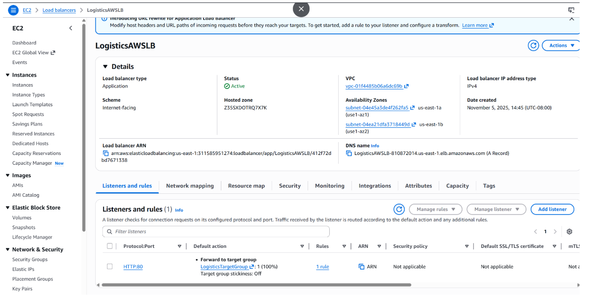
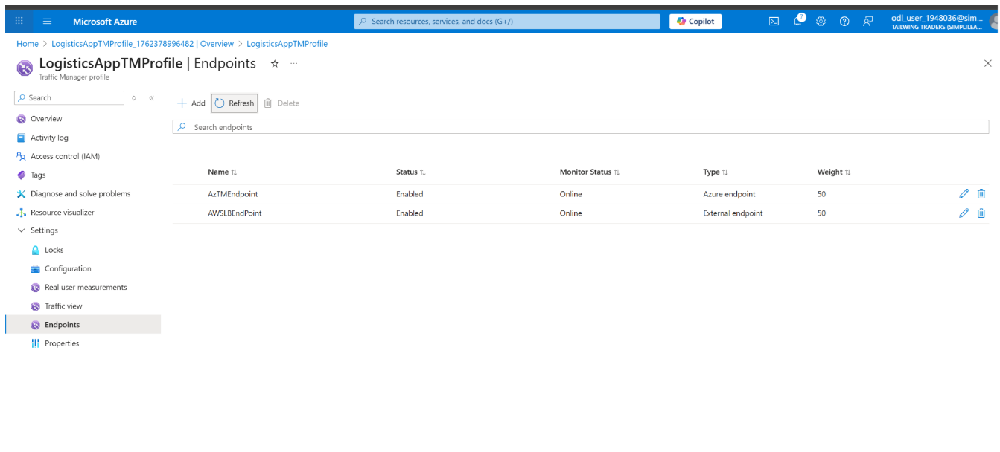

# Case Study: Multi‑Cloud Application Deployment (AWS + Azure)

## Overview
This project demonstrates a highly available **multi‑cloud deployment** of a static web application across **AWS and Azure**. The solution uses **Azure Traffic Manager** for weighted DNS routing, enabling active‑active traffic distribution and seamless failover during outages. It highlights cross‑cloud networking, load balancing, DNS routing, and resiliency engineering.

---

## Project Scenario
A logistics company with a high‑traffic B2C web application required **global accessibility** and **zero downtime**, even during cloud‑provider outages. To validate multi‑cloud readiness, the application was deployed in **both AWS and Azure**, with unified DNS routing and health‑based failover.

---

## Architecture
The solution follows an **active‑active architecture** with weighted routing:

- **AWS:** EC2 instances behind an Application Load Balancer  
- **Azure:** Virtual Machines behind an Azure Load Balancer  
- **Global Routing:** Azure Traffic Manager (Weighted + Priority routing)  
- **Networking:** Isolated VPC/VNet environments with secure inbound rules  
- **Monitoring:** CloudWatch + Azure Monitor for endpoint health  

**Architecture Diagram**  

 
---

## Implementation Summary
- Deployed identical static web workloads on **AWS EC2** and **Azure VMs**.  
- Configured **AWS Load Balancer** and **Azure Load Balancer** for intra‑cloud traffic distribution.  
- Integrated both cloud endpoints into **Azure Traffic Manager** using weighted routing.  
- Configured health probes to detect endpoint failures and trigger automatic failover.  
- Validated routing behavior by simulating outages in each cloud environment.  

---

## Validation & Testing
- Verified weighted traffic distribution (e.g., 70% AWS / 30% Azure).  
- Simulated VM and load balancer failures to test resiliency.  
- Confirmed **<5 seconds** DNS failover time during endpoint outages.  
- Ensured consistent application availability across both clouds.  

---

## Screenshots
 AWS Load Balancer configuration
    

 Azure Load Balancer configuration
    
  
 Azure Traffic Manager routing profile  
  

---

## Lessons Learned
- DNS‑based failover is a simple and effective cross‑cloud resiliency mechanism.  
- Weighted routing enables controlled traffic distribution across providers.  
- VM hosting increases complexity but supports legacy and compliance needs.  
- Cross‑cloud troubleshooting requires strong monitoring and logging practices.  

---

## Tech Stack
**AWS:** EC2, VPC, Subnets, Security Groups, Application Load Balancer  
**Azure:** Virtual Network, Subnets, Azure VMs, Azure Load Balancer, Traffic Manager  
**Web Server:** Apache (Amazon Linux 2, Ubuntu)

---

## Outcome
This project delivered a resilient, globally accessible multi‑cloud architecture using AWS and Azure. It demonstrated hands‑on expertise in cross‑cloud networking, load balancing, DNS routing, and high‑availability design.
