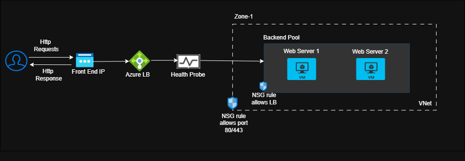
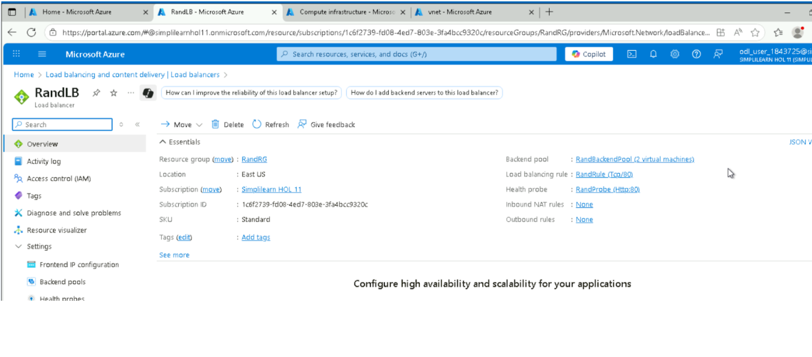
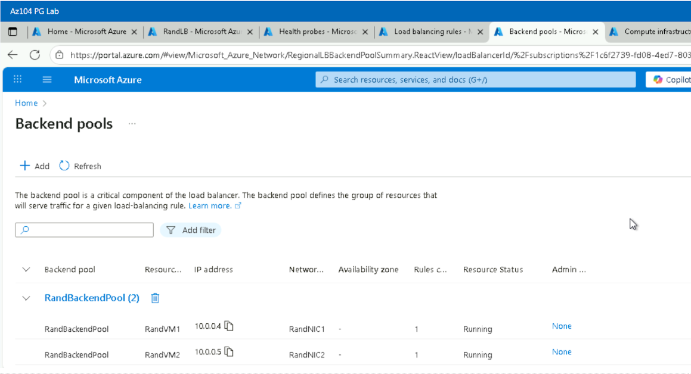
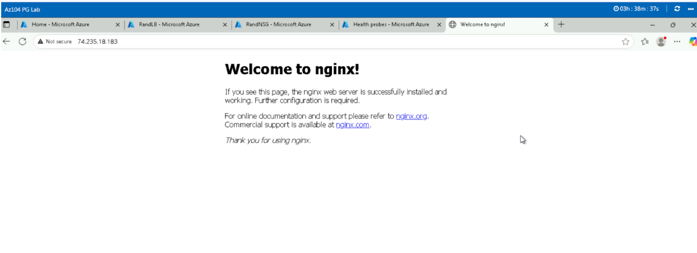

# Case Study: Highly Available Architecture Using Azure CLI

## Overview
This project demonstrates how to design and deploy a highly available web application architecture on Microsoft Azure using the Azure CLI. The solution distributes incoming traffic across multiple virtual machines, ensuring that only healthy instances serve user requests. This setup improves uptime, fault tolerance, and operational consistency through automation.

## Project Scenario
Rand Enterprises wants to deploy a web application in a highly available environment where only healthy VM instances serve traffic. To avoid exposing VMs directly to the internet, all communication must flow through an Azure Public Load Balancer.  
The operations team also requires a reusable, script‑driven deployment method using Azure CLI to support future automation and consistent provisioning.

## Architecture
- **Virtual Network (VNet)** with a dedicated subnet  
- **Two Linux Virtual Machines** hosting the application  
- **Azure Public Load Balancer** with:
  - Frontend IP configuration  
  - Backend pool  
  - Health probe  
  - Load balancing rule  
- **Traffic distribution** only to healthy VM instances  
- **Azure CLI automation** for reproducibility  

**Architecture Diagram**

 
---
### Key Components
- Azure Virtual Network & Subnet  
- Azure Public Load Balancer  
- Backend Pool  
- Health Probe (TCP/HTTP)  
- Load Balancing Rule  
- Two Virtual Machines (Linux)  
- Azure CLI automation scripts  

## Implementation Summary
- Provisioned a VNet and subnet using Azure CLI  
- Created two Linux VMs in the same subnet  
- Provisioned a Public IP for the Load Balancer  
- Created the Load Balancer, backend pool, and frontend configuration  
- Added a health probe to monitor VM availability  
- Configured a load balancing rule to distribute traffic  
- Attached both VMs to the backend pool  
- Validated high availability by simulating VM failures and observing seamless failover  

## Validation & Testing
- Verified that both VMs served the application through the Load Balancer  
- Stopped one VM to simulate failure and confirmed traffic automatically redirected to the healthy instance  
- Ensured the Load Balancer health probe correctly detected unhealthy VMs  
- Confirmed consistent uptime during test scenarios  

## Screenshots 
Load Balancer configuration
  
     
Backend Pool
  
     
VM failover test results
       
## Lessons Learned
- Importance of health probes in maintaining high availability  
- How Azure Load Balancer routes traffic only to healthy instances  
- Benefits of using Azure CLI for reproducible infrastructure deployments  
- How to validate failover behavior in a controlled environment  
- Understanding backend pool associations and VM networking  

## Tech Stack
- **Azure Services:** Virtual Network, Virtual Machines, Public Load Balancer  
- **Tools:** Azure CLI, Bash  
- **Compute:** Linux VMs  
- **Networking:** Subnets, Public IP, Load Balancing  

## Outcome
This project successfully delivered a highly available Azure architecture using fully automated Azure CLI commands. The environment demonstrated fault tolerance, seamless traffic redirection, and consistent uptime—meeting Rand Enterprises’ requirement for a secure, resilient, and reusable deployment model.

[View the full project on GitHub](https://github.com/selvi-vasanth/cloud-portfolio/tree/main/featured-projects/project2)
