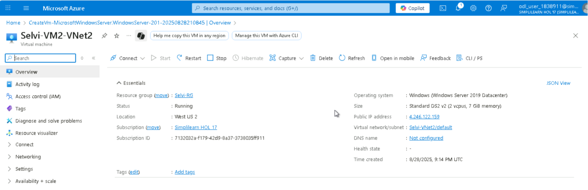
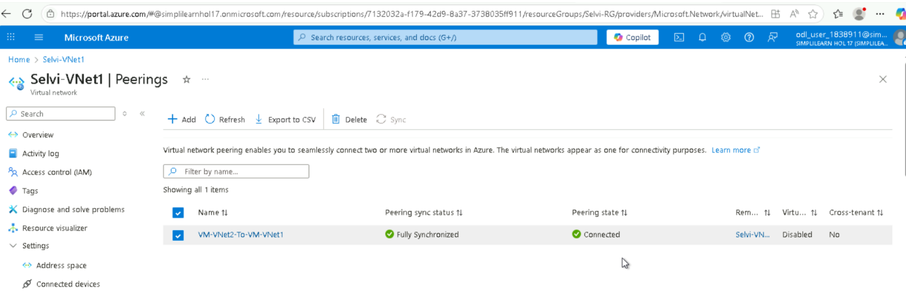
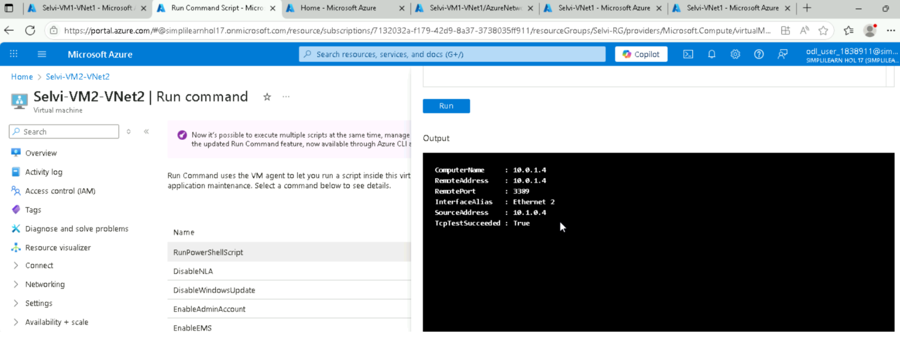
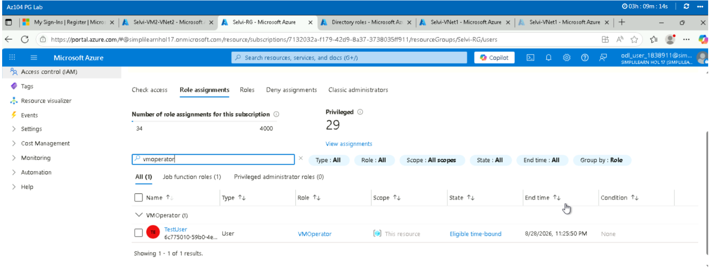
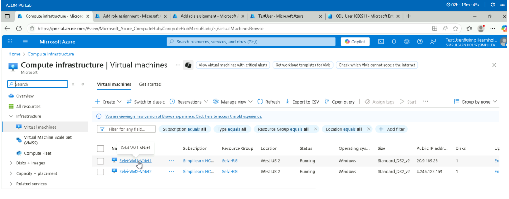

# Case Study: Secure Networking & RBAC (Azure)

## Overview
This project demonstrates secure connectivity between workloads hosted in separate Azure Virtual Networks (VNets) using VNet peering. It also implements a custom Role‑Based Access Control (RBAC) role to enforce least‑privilege access for an onboarded user, ensuring governance and operational security.

## Project Scenario
Rand Enterprises is evaluating Azure as a deployment platform. To validate Azure’s networking and security capabilities, the company requested a proof‑of‑concept that connects workloads across VNets and applies custom access controls for an employee.

## Architecture
- Two Azure Virtual Networks (VNets) located in separate regions  
- Dedicated subnets within each VNet  
- Virtual Machines in each VNet for workload simulation  
- VNet Peering enabling private, low‑latency communication between VNets  
- Azure Active Directory providing identity and access management  
- Custom RBAC role defining least‑privilege access boundaries  
- Role assignment at the resource group scope for controlled governance  

**Architecture Diagram**

 

---
## Key Components
- **Networking:** VNet1, VNet2, Subnets, VNet Peering  
- **Compute:** VM1, VM2  
- **Identity:** Azure Active Directory, Custom RBAC Role  
- **Governance:** Role assignment, least‑privilege enforcement  

---

## Implementation Summary
- Built two VNets with associated subnets and VMs  
- Configured VNet peering to enable secure cross‑network communication  
- Created a custom RBAC role with permissions to read VM, network, and storage resources, and start/restart VMs  
- Onboarded a user into Azure AD and assigned the custom role  
- Validated connectivity between VMs across VNets  
- Verified that the user could only perform actions defined in the custom role  

---

## Validation & Testing
- Ping/SSH tests confirmed secure cross‑VNet connectivity  
- RBAC validation ensured the user had only least‑privilege access  
- Confirmed restricted access to VM, network, and storage operations  
- Verified that unauthorized actions were blocked  

---
## Screenshots
VNet creation and Peering setup

  
  
     
VNet Peering test

  
     
User access validation

       
    

---

## Lessons Learned
- VNet peering provides seamless, low‑latency connectivity across VNets  
- Custom RBAC roles are essential for enforcing least‑privilege access  
- Validating connectivity and permissions ensures both networking and governance requirements are met  

---

## Tech Stack
- **Azure Virtual Network (VNet)**  
- **Azure Virtual Machines (VMs)**  
- **Azure VNet Peering**  
- **Azure Active Directory (Azure AD)**  
- **Azure RBAC (Custom Role)**  

---

## Outcome
This project successfully demonstrated Azure’s ability to connect workloads across VNets using peering and enforce governance through custom RBAC roles. Rand Enterprises validated Azure as a secure and flexible platform for enterprise workloads, with strong networking and identity management capabilities.

[View the full project on GitHub](https://github.com/selvi-vasanth/cloud-portfolio/tree/main/featured-projects/project3)
