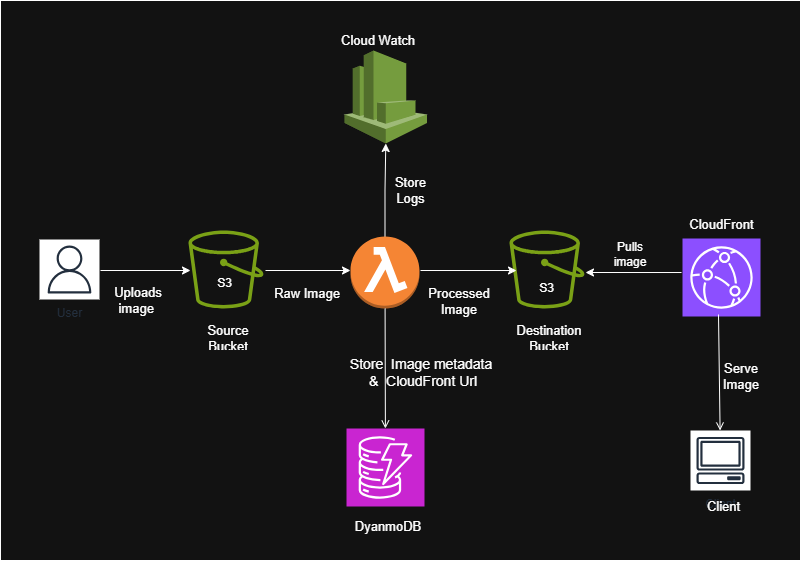

# Case Study: Serverless Image Processing Pipeline (AWS)

## Overview
This project implements an end-to-end workflow where users upload images to an S3 bucket, triggering a Lambda function that processes the image and stores metadata. The processed images are then delivered globally through CloudFront, showcasing a fully serverless, event-driven image processing pipeline on AWS.

### The pipeline showcases:
- Event-driven architecture  
- AWS Lambda for backend processing  
- S3 triggers  
- DynamoDB for metadata storage  
- IAM least-privilege design  
- CloudFront CDN integration  
- CloudWatch logging and monitoring  

---

## Project Scenario
A media-centric application needs to automatically process user-uploaded images without managing servers or container infrastructure. The goal is to resize images, extract metadata, store structured information, and deliver optimized outputs globally with minimal operational overhead.  
This project serves as a proof-of-concept demonstrating how AWS managed services can be combined to build a scalable, secure, and cost-efficient image processing pipeline.

---

## Architecture
- **S3 (raw-images)** — Stores original uploaded images  
- **Lambda (image-processor)** — Generates thumbnails, extracts metadata, writes to DynamoDB  
- **DynamoDB (ImageMetadata)** — Stores image details and CloudFront URLs  
- **S3 (processed-images)** — Stores processed thumbnails  
- **CloudFront Distribution** — Serves processed images globally  
- **IAM Roles** — Scoped permissions for Lambda execution  
- **CloudWatch Logs** — Tracks Lambda execution and errors  

**Architecture Diagram**

 

---

## Key Components
- **Storage:** AWS S3 buckets for raw and processed images  
- **Compute:** AWS Lambda (Python with Pillow)  
- **Database:** DynamoDB table `ImageMetadata`  
- **Eventing:** S3 → Lambda trigger on `ObjectCreated:*`  
- **Security:** IAM least-privilege execution role  
- **Delivery:** CloudFront distribution with S3 origin (OAC optional)  
- **Monitoring:** CloudWatch Logs for execution and error tracking  

---

## Implementation Summary
- Created two S3 buckets:
  - `raw-images-<unique>` for uploads  
  - `processed-images-<unique>` for thumbnails  
- Created a DynamoDB table **ImageMetadata** with partition key `imageId`  
- Built a Lambda function (`image-processor`) using Python and Pillow  
- Implemented thumbnail generation (e.g., 200×200)  
- Extracted metadata (size, format, timestamp)  
- Wrote metadata and CloudFront URLs to DynamoDB  
- Uploaded processed images to the `processed-images` bucket  
- Added S3 → Lambda trigger on `ObjectCreated:*`  
- Configured CloudFront with the `processed-images` bucket as origin  
- Enabled Origin Access Control (OAC) for secure S3 access (optional)  

---

## Validation & Testing
- Uploaded multiple images to the raw S3 bucket  
- Verified Lambda execution via CloudWatch Logs  
- Confirmed thumbnails generated correctly in the processed bucket  
- Checked DynamoDB entries for metadata and URLs  
- Validated CloudFront delivery using public CDN URLs  
- Ensured IAM permissions followed least-privilege principles  

## Screenshots
  S3 Buckets
   
  
  AWS Lambda Function
   
  
 CloudFront Distribution  
 

 Processed Buckets  
  

---

---

## Screenshots
- S3 bucket configuration and object uploads  
- Lambda function configuration and CloudWatch Logs  
- DynamoDB `ImageMetadata` table entries  
- CloudFront distribution and URL access tests  

---

## Lessons Learned
- Serverless architectures significantly reduce operational overhead for media processing workloads  
- S3 event triggers provide a clean, decoupled pattern for file-based automation  
- DynamoDB is well-suited for storing lightweight, queryable image metadata and URLs  
- IAM least-privilege design is critical for securing serverless pipelines  
- CloudFront integration greatly improves global performance and user experience  

---

## Tech Stack
- **AWS S3** — Object storage for raw and processed images  
- **AWS Lambda** — Event-driven compute (Python + Pillow)  
- **AWS DynamoDB** — NoSQL metadata storage  
- **AWS CloudFront** — Global CDN for processed images  
- **AWS IAM** — Secure access control  
- **AWS CloudWatch** — Logging and monitoring  
- **Language:** Python  

---

## Outcome
This project successfully demonstrates a fully serverless, event-driven image processing pipeline using AWS managed services. The solution automates image resizing, metadata extraction, and global delivery while maintaining a secure, scalable, and cost-efficient architecture suitable for production workloads and media-heavy applications.

---

     <a href="https://selvi-vasanth.github.io/cloud-portfolio/">
     Portfolio Home →
     </a> 
     <a href="https://github.com/selvi-vasanth/cloud-portfolio/tree/main/featured-projects/serverless-image-processing">
     Repository link →
     </a>

