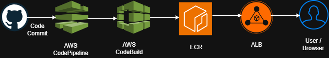

# CI/CD Pipeline Automation (AWS)

## Overview
This project implements a fully automated CI/CD pipeline for deploying a Spring Boot application to Amazon ECS using AWS CodePipeline, CodeBuild, and Elastic Container Registry (ECR). The pipeline builds, containerizes, and deploys the application with zero manual intervention, ensuring fast, reliable, and repeatable deployments.

## Project Scenario
A retail company relies on a Spring Boot–based inventory management system used across multiple departments. Deployment updates were manual, slow, and error‑prone. To improve release velocity and reduce operational overhead, the company required a fully automated CI/CD pipeline that triggers on every GitHub commit and deploys the updated application to ECS seamlessly.

## Architecture
- GitHub repository as the source for application code  
- AWS CodePipeline orchestrating the CI/CD workflow  
- AWS CodeBuild compiling the Spring Boot application and building Docker images  
- Amazon ECR storing versioned container images  
- Amazon ECS (EC2 launch type) running the containerized application  
- Application Load Balancer exposing the service publicly  
- Automated deployment triggered on every GitHub push  

**Architecture Diagram**

 
     
## Key Components
- **Source Control:** GitHub repository  
- **Build & Packaging:** Maven, Docker, AWS CodeBuild  
- **Container Registry:** Amazon ECR  
- **Orchestration:** AWS CodePipeline  
- **Compute:** Amazon ECS (EC2 launch type)  
- **Networking:** Application Load Balancer, VPC, Subnets  
- **Deployment:** ECS Service + Task Definition updates  

## Implementation Summary
- Created an ECR repository to store Docker images  
- Set up a GitHub repository and pushed the Spring Boot application code  
- Configured CodeBuild with a `buildspec.yml` to:  
  - Build the JAR using Maven  
  - Build and tag Docker images  
  - Push images to ECR  
  - Generate `imagedefinitions.json` for ECS deployment  
  - Created an ECS cluster, task definition, and service using EC2 launch type  
  - Built a CodePipeline with three stages:  
    1. **Source:** GitHub  
    2. **Build:** CodeBuild  
    3. **Deploy:** ECS  
  - Validated that every GitHub commit triggered a full build and deployment cycle  

## Validation & Testing
- Verified successful Docker image pushes to ECR  
- Confirmed CodeBuild logs for Maven build, Docker build, and image push  
- Ensured ECS task definition updated automatically with new image tags  
- Tested application endpoints via the Application Load Balancer  
- Validated multiple deployments using GitHub commits  

## Screenshots

- ECR repository creation  
- GitHub repository setup and initial commit  
- CodeBuild project creation and successful build logs  
- ECS cluster, task definition, and service deployment  
- Load balancer endpoint showing application responses  
- CodePipeline execution with all stages succeeding  

## Lessons Learned
- Automating CI/CD significantly reduces deployment time and human error  
- ECR + ECS + CodePipeline provides a powerful, fully managed deployment workflow  
- Buildspec files are critical for customizing build and packaging steps  
- ECS EC2 launch type offers flexibility and control over compute resources  
- Versioned Docker images ensure traceability and rollback capability  

## Tech Stack
- **AWS CodePipeline**  
- **AWS CodeBuild**  
- **Amazon ECR**  
- **Amazon ECS (EC2 launch type)**  
- **Application Load Balancer**  
- **Docker**  
- **Maven**  
- **Spring Boot**  
- **GitHub**  

## Outcome
This project successfully automated the end‑to‑end deployment of a Spring Boot application using AWS CI/CD services. The pipeline reduced manual release effort by 80%, improved deployment reliability, and demonstrated a scalable, production‑ready workflow suitable for enterprise applications.

[View the full project on GitHub](https://github.com/selvi-vasanth/cloud-portfolio/tree/main/featured-projects/project3)
